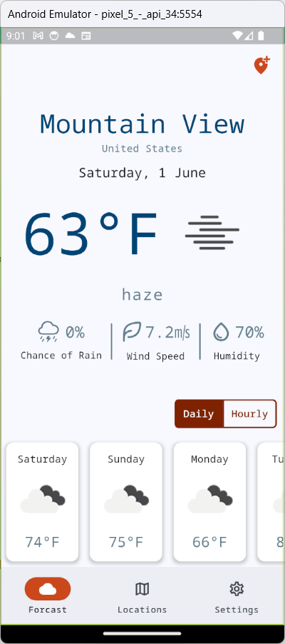
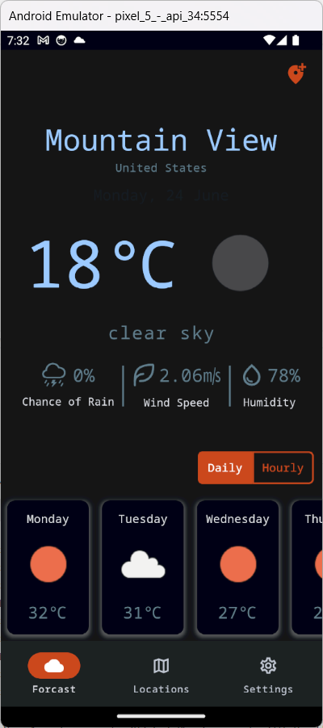

# Bweather

Bweather is a weather application written with Flutter. It provides weather information including temperature, weather conditions, chance of rain, wind speed, and humidity. The application features both light and dark modes.

## Screenshots

### Light Mode


### Dark Mode


## Features

- Current weather information
- 7-day weather forecast
- Light and dark mode support
- Detailed weather metrics such as wind speed and humidity
- Intuitive and user-friendly interface

## Installation

To get a local copy up and running follow these simple steps:

1. Clone the repo
   ```sh
   git clone https://github.com/lordBman/bweatherflutter.git

2. Navigate to the project directory
   ```sh
   cd Bweather

3. Install the dependencies
    ```sh
    flutter pub get

4. Run the app
    ```sh
    flutter run

## Usage

1. Open the app.
2. Allow location access to get weather updates for your current location.
3. Use the tabs to switch between daily and hourly forecasts.
4. Toggle between light and dark mode through the settings.

## Contributing

Contributions are what make the open-source community such an amazing place to learn, inspire, and create. Any contributions you make are **greatly appreciated**.

1. Fork the Project
2. Create your Feature Branch (`git checkout -b feature/AmazingFeature`)
3. Commit your Changes (`git commit -m 'Add some AmazingFeature'`)
4. Push to the Branch (`git push origin feature/AmazingFeature`)
5. Open a Pull Request

## License

Distributed under the MIT License. See `LICENSE` for more information.

## Contact

Project Link: [https://github.com/lordBman/bweatherflutter](https://github.com/lordBman/bweatherflutter)